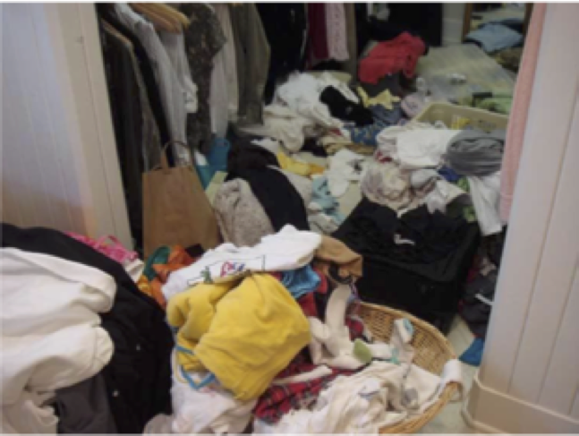
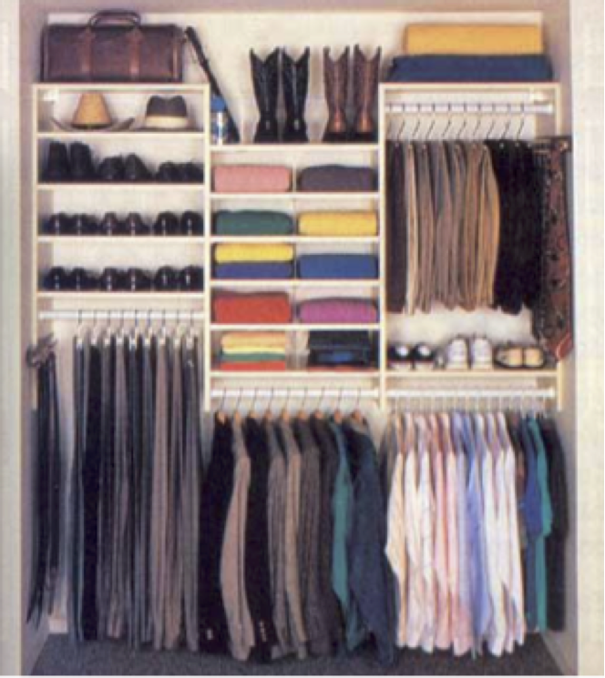

..  Copyright (C)  Dave Parillo.  Permission is granted to copy, distribute
    and/or modify this document under the terms of the GNU Free Documentation
    License, Version 1.3 or any later version published by the Free Software
    Foundation; with Invariant Sections being Forward, and Preface,
    no Front-Cover Texts, and no Back-Cover Texts.  A copy of
    the license is included in the section entitled "GNU Free Documentation
    License".

.. index:: associative containers
   single: trees

Tree ADT concepts
=================
If sequence containers like :cref:`vector` are so great,
then why would we need anything else?

In a word: search.

When we have millions a elements in a data structure and need to find
just one element, or a specific range or elements,
we *could* use a ``vector``.

Inserts are fast. 
No matter how many elements are already in a ``vector``
adding one more using :cref:`vector::push_back` takes
the same amount of time.
That is, the time cost of ``push_back`` is *constant* for a ``vector``.

A ``vector`` is default ordered only by its index position,
not by the values stored within it.
It's easy to keep throwing items in without paying any attention
to how they are ordered.

But always using ``push_back`` is analogous to a messy closet.
We could consider the closet to be ordered by *depth*:
the last things thrown in the closet are on the top of the pile.

This makes getting a specific item from the closet slow.
If we only ever want to to access the last item we added, 
then we know exactly where to go.
But if we want to find some arbitrary item,
we have to search the vector 1 element at a time until we find it.

.. code-block:: cpp

   vector<int> messy_closet (1024 * 1024 * 1024);  // a fairly big vector
   
   // modify closet . . . 

   cout << "Go get some coffee while I work on this. . . \n";
   for (const auto& v: messy_closet) {
     if (v == search_val) {
       do_something(v);
     }
   }

Sometimes we may get lucky and find the desired element at index position 0.
If the data added to the vector is random, 
then this becomes increasingly less likely as the size grows.

We might sometimes get very unlucky and not find the element until we access
the last element.
Over many searches, on average, 
we will have to examine :math:`N \over 2` elements.

It's easy to see that the more elements are added, 
the longer searches will take.

We need a tidy closet.

We could sort the ``vector``, which would speed up our search.
The basic idea is to sort the vector, 
then examine the value at position :math:`N \over 2`.
If the value found is greater than the value we are looking for,
then examine the value at position :math:`N \over 4`,
else examine the value at position :math:`3N \over 4`.

At each step,
we eliminate the number of remaining elements we need
to search in our ``vector`` by half.
For a large ``vector``, this saves a lot of time.

This technique requires that we keep the vector sorted.
If elements are added or removed frequently,
then adding data to our vector, which used to be fast, is now slow.
We can either use :cref:`vector::push_back` followed by :cref:`vector::sort`,
or use :cref:`vector::insert`.
*Every* addition becomes a search and we are back to the original problem.
On average, it will take :math:`N \over 2` comparisons to add new data.

How can we solve this problem?

Can we make an :term:`ADT` whose performance does not degrade
as the number of elements in the :term:`ADT` grows large?

Yes, but we need a new idea.
Instead of a sequential container, we need a :term:`tree`.

The tree ADT
------------
A :term:`tree` is a *hierarchical* abstract data type.
Conceptually, it can be thought of as a collection of
*nodes* defined by parent-child relationships.

One node is the :term:`root`.
It serves as the 'trunk' of the tree and serves the same
function as the :term:`head` of a :term:`list`
The root node is the *only* node in a tree without a parent.
All other nodes in a :term:`tree` refer to exactly 1 parent.
In a :term:`binary tree`, 
the children are commonly referred to as the **left** and **right** nodes.

.. digraph:: a_tree
   :alt: A simple binary tree

   graph [
          labelloc=b;
          label="A simple binary tree";
       ];

   node [fontname = "Bitstream Vera Sans", fontsize=14,
                 style=filled, fillcolor=lightblue]

   root -> left,right [dir=none];

Yes, programmers draw trees upside-down.
The :term:`root` is above the branches.

The :term:`height` of a tree is the count of the nodes along the longest path in a tree
from the :term:`root` to a :term:`leaf node`.

.. digraph:: larger
   :alt: A tree of height 4

   graph [
          nodesep=0.25, ranksep=0.3, splines=line;
          labelloc=b;
          label="A tree of height 4";
       ];
   node [fontname = "Bitstream Vera Sans", fontsize=14,
         style=filled, fillcolor=lightblue,
         shape=circle, fixedsize=true, width=0.3];
   edge [weight=1, arrowsize=0.5, dir=none];

   a, b, am, c, d, bm, e, f, cm, g, h, dm, i, j, em, k, l, fm, m;
   am, bm, cm, dm, em, fm [style=invis, label=""];

   a->b [color=red, penwidth=2, dir=forward];
   a->c;
   b->d [weight=2]; // nudge b: trees b & c are not balanced
   b->e [color=red, penwidth=2, dir=forward];
   c->f,g;
   d->h,i;
   e->j [color=red, penwidth=2, dir=forward];
   e->k;
   f->l,m;

   edge [style=invis, weight=100];
   d->dm; 
   e->em;
   b->bm;
   f->fm;
   c->cm;
   a->am;
   
Although there are many different types of trees, 
we need only worry about :term:`binary trees <binary tree>`.
A :term:`binary tree` is a tree in which no node has more than 2 children.
Any tree node may have 0, 1, or 2 children.
A tree node with no children is a :term:`leaf node`.

All of these are valid :term:`binary trees <binary tree>`:

.. graph:: example_trees
   :alt: example binary trees

   graph [color=white;
          labelloc=b;
          ranksep=0.25;
          labelloc=b;
          fontsize=14;
          label="Example binary trees";
    ];

    node [shape=circle, height=0.1, label="",
                  style=filled, fillcolor=lightblue
    ];

    subgraph cluster_0 {
      label="";
      one;
    }

    subgraph cluster_1 {
      label="";
      a -- b;
      c [style=invis];
      a -- c [style=invis];
    }

    subgraph cluster_2 {
      label="";
      e [style=invis];
      d -- e [style=invis];
      d -- f;
    }

    subgraph cluster_3 {
      label="";
      root -- left;
      root -- right;
    }

    subgraph cluster_4 {
      label="";
      l -- m -- n -- o -- p -- q -- r;
      node [style=invis];
      edge [weight=2, style=invis];
      c1 -- c2 -- c3 -- c4 --c5 --c6 -- c7 [constraint=false];
      c1 -- l
      c2 -- m
      c3 -- n
      c4 -- o
      c5 -- p
      c6 -- q
      c7 -- r
   
      {rank=same; c1 c2 c3 c4 c5 c6 c7};
    }

    subgraph cluster_5 {
      label="";
      1, 2, m1, 3, 4, m2, 5, m3, 7, 8, m5, 9, 10, m9, 11, m10, 12;
      m1, m2, m3, m5, m9, m10 [style=invis];

      1 -- 2,3;
      2 -- 4,5;
      3 -- 7;
      5 -- 8,9;
      9 -- 10;
      10 -- 11,12;
      edge [weight=2, style=invis];
      1 -- m1;
      2 -- m2;
      3 -- m3;
      5 -- m5;
      9 -- m9;
      10 -- m10;
    }

    edge [style=invis];
    c -- root;
    f -- 1;

A :term:`balanced tree`
(one with the roughly equal numbers of nodes
in each :term:`subtree`), 
provides the tidy room we need to ensure
reasonably fast inserts **and** retrievals.
A tree must be both balanced and sorted 
for us to gain benefits from a tree.

When a tree is balanced and sorted,
the cost of both inserts and retrievals are on average :math:`log_2{N}`.
Binary trees provide a way for us to 'formalize'
our half-splitting solution.

Unbalanced trees are not much more than fancy 
:term:`linked lists <linked list>`.
The performance of unbalanced trees degrades
back to the messy room,
with all of the problems and none of the benefits.

Balanced trees are the data structures
that support both sets and maps.

-----

.. admonition:: More to Explore

   - `STL containers library <http://en.cppreference.com/w/cpp/container>`_
   - `Visualgo: binary heap <https://visualgo.net/en/heap?slide=1>`_

